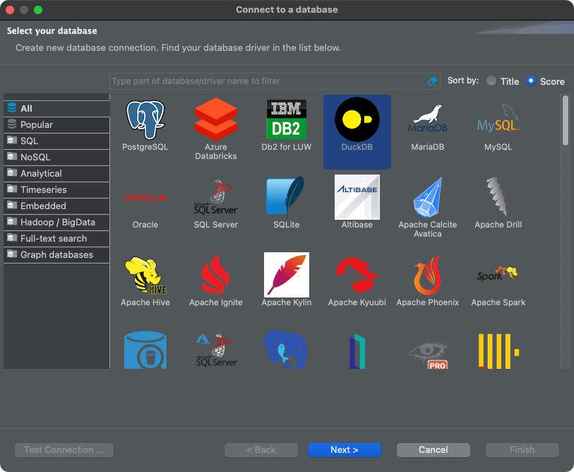
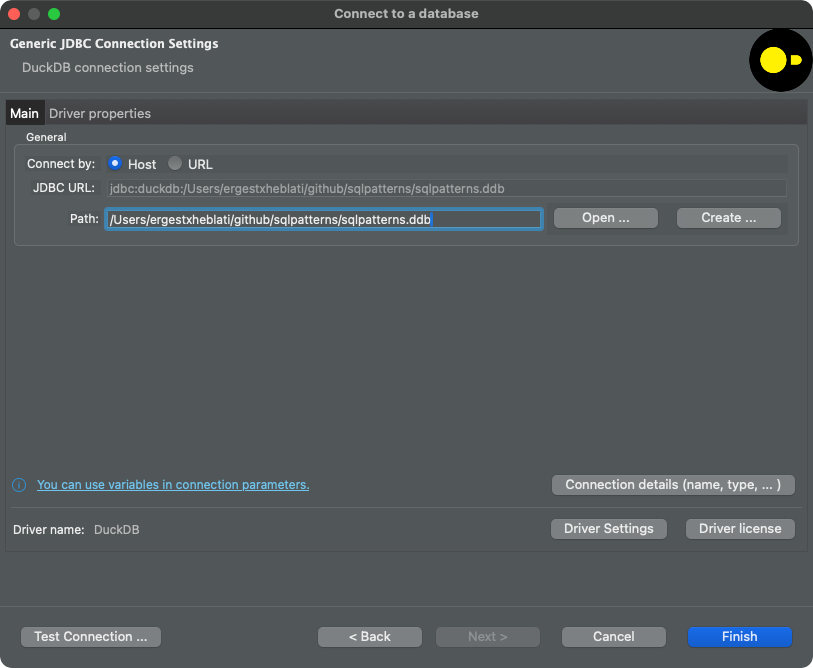

# Setting up a local database with DuckDB
This document will walk you through the necessary steps required to set up a local DuckDB development environment. We'll cover the basics of setting up a DuckDB database with parquet files and a dbt + DuckDB development environment for the new chapter on dbt patterns. You can either choose the `dbt` setup (recommended) or the non `dbt` setup.

## Installing Python and dbt
First make sure you have python installed. If you don't have Python installed you can install it on a Mac using [brew](https://brew.sh) by issuing `brew install python` or by installing [miniconda.](https://docs.anaconda.com/free/miniconda/miniconda-install/) If you're using `conda` set up a new environment for it and install `dbt-core` and `dbt-duckdb`
```
conda create --name dbt python
conda activate dbt
conda install pip
pip install dbt-core dbt-duckdb
```

If you're using brew follow the instructions [here](https://docs.getdbt.com/docs/core/pip-install) to install python and dbt. If everything is set up correctly you should be able to run the command `dbt --version` and see output that looks roughly like this:
```dbt --version            
Core:
  - installed: 1.8.1
  - latest:    1.8.1 - Up to date!

Plugins:
  - duckdb:   1.8.1 - Up to date!
```

_Note:_ If you're using VSCode for your development, I highly recommend you download and install the `Power User for dbt Core` VSCode extension [here](https://marketplace.visualstudio.com/items?itemName=innoverio.vscode-dbt-power-user) It should walk you through the steps of connecting to your dbt virtual environment so you can build dbt models from a right click menu inside VSCode as well as view lineage.

## Clone the github repo into your local folder
Before you do anything you'll need to clone this repo locally. Create a folder where you'll be doing all the work called `sqlpatterns` Then cd into the folder and clone the repo. I'm assuming you know how to use basic `git` commands, but really all you need to run is `git clone https://github.com/ergest/sqlpatterns.git` This should get you all the necessary files to set up a local DuckDB database. This repo is a `dbt` setup so you'll want to install `dbt` first.
```
mkdir sqlpatterns
cd sqlpatterns
git clone https://github.com/ergest/sqlpatterns.git
```

## Build the DuckDB database using dbt
Now that you have installed dbt it's time to set up your local database where you'll do all the development required in the book. Open a new terminal / command line window. Change the directory to this repo and issue the command `dbt build`
```
cd sqlpatterns
dbt deps
dbt build
```
You should see something like this:
```
dbt deps
22:09:11  Running with dbt=1.8.1
22:09:12  Installing dbt-labs/dbt_utils
22:09:12  Installed from version 1.2.0
22:09:12  Up to date!

dbt build
22:58:23  Running with dbt=1.8.1
22:58:23  Registered adapter: duckdb=1.8.1
22:58:23  Found 14 models, 1 seed, 12 data tests, 522 macros
22:58:23  
22:58:24  Concurrency: 4 threads (target='dev')
22:58:24  
22:58:24  1 of 27 START sql table model main.comments .................................... [RUN]
22:58:24  2 of 27 START sql table model main.post_history ................................ [RUN]
22:58:24  3 of 27 START sql table model main.posts_answers ............................... [RUN]
22:58:24  4 of 27 START sql table model main.posts_questions ............................. [RUN]
22:58:25  1 of 27 OK created sql table model main.comments ............................... [OK in 1.10s]
22:58:25  5 of 27 START sql table model main.users ....................................... [RUN]
22:58:26  5 of 27 OK created sql table model main.users .................................. [OK in 0.50s]
22:58:26  6 of 27 START sql table model main.votes ....................................... [RUN]
22:58:26  6 of 27 OK created sql table model main.votes .................................. [OK in 0.15s]
22:58:26  7 of 27 START seed file main.post_history_type_mapping ......................... [RUN]
22:58:26  7 of 27 OK loaded seed file main.post_history_type_mapping ..................... [INSERT 35 in 0.05s]
...
...
22:58:42  Completed successfully
```
If everything worked, you should see a new file created locally called `sqlpatterns.ddb` You can access this file using the DuckDB CLI or DBeaver.

## Connecting to the newly created database
You now have two options to connect to this database to issue SQL queries. I strongly recommend using an IDE like DBEaver but if you want to use the DuckDB CLI feel free to do that as well.

### Install DuckDB on your local machine
DuckDB is an blazing fast OLAP database that can work directly with parquet files. It has amazing SQL capabilities but we'll stick with the basics for this book. Go to [duckdb.org](https://duckdb.org/#quickinstall) and choose the installation option for your platform. For MacOS I simply did `brew install duckdb` which of course requires you have [brew](https://brew.sh) installed. Test your installation by issuing the command `duckdb` on your terminal. You should see a prompt that looks like this:
```
duckdb sqlpatterns.ddb                
v1.0.0 1f98600c2c
Enter ".help" for usage hints.
Connected to a transient in-memory database.
Use ".open FILENAME" to reopen on a persistent database.
D select * from post_history;
┌───────────┬──────────────────────┬──────────┬──────────────────────┬───┬─────────┬──────────────────────┬──────────────────────┐
│    id     │    creation_date     │ post_id  │ post_history_type_id │ … │ user_id │         text         │       comment        │
│   int64   │      timestamp       │  int64   │        int64         │   │  int64  │       varchar        │       varchar        │
├───────────┼──────────────────────┼──────────┼──────────────────────┼───┼─────────┼──────────────────────┼──────────────────────┤
│ 259107132 │ 2021-12-01 01:37:0…  │ 70178148 │                    2 │ … │         │ I think they fixed…  │                      │
│ 259108536 │ 2021-12-01 02:23:2…  │ 70178420 │                    2 │ … │         │ I've been back tra…  │                      │
│ 259108538 │ 2021-12-01 02:23:2…  │ 70178420 │                    1 │ … │         │ Adding a video int…  │                      │
│ 259108539 │ 2021-12-01 02:23:2…  │ 70178420 │                    3 │ … │         │ <android-studio><a…  │                      │
│ 259110260 │ 2021-12-01 03:10:1…  │ 70178687 │                    2 │ … │         │ I am using data ta…  │                      │
│ 259110262 │ 2021-12-01 03:10:1…  │ 70178687 │                    1 │ … │         │ DD() prints value …  │                      │
```
You can now issue SQL commands like above or type `.exit` + Enter to exit back to your prompt. DuckDB [documentation](https://duckdb.org/docs/index) is really good if you're curious to learn more.

### Install DBeaver
Next you'll need an SQL IDE to write your queries and I highly recommend **DBeaver Community**. It's free and it works with pretty much any database, including DuckDB
Go to [dbeaver.io](https://dbeaver.io/download/) and download the installer for your platform. Since it's written in Java, it supports just about any operating system. Make sure you exit DuckDB first. Since it relies on a single file for it's database, the file should not be locked by any other processes.

Open *DBeaver* and set up a new DuckDB connection. If you've never done this before you might have to download the DuckDB drivers.

Choose the newly created `sqlpatterns.ddb` file and click Finish

